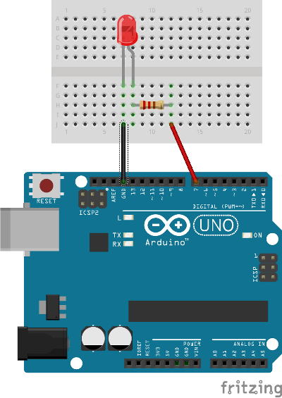

Turn on/off a LED from a web page
=================================

To get you excited, see [this video of how it works](http://www.youtube.com/watch?v=FQF7L7dGW3E)

Connect LED to your board as follows

install npm packages with

    $ npm install

and run the code with

    $ node server.js
    
Now you should be able to access page that drives the led at something like:

[http://ip_of_your_galileo:8080/index.html](http://ip_of_your_galileo:8080/index.html)
